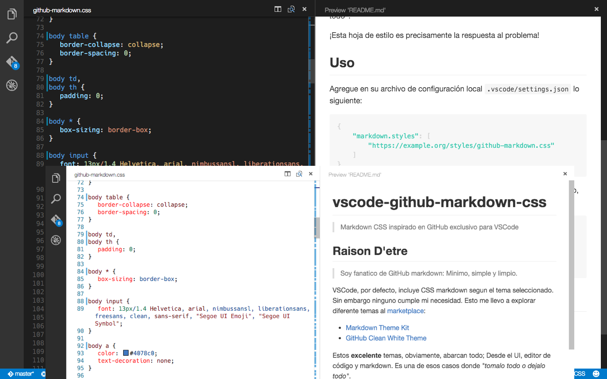

# vscode-github-markdown-css
> Markdown CSS inspirado en GitHub exclusivo para VSCode



## Raison D'etre
> Soy fanatico de GitHub markdown: Minimo, simple y limpio.

VSCode, por defecto, incluye CSS markdown segun el tema seleccionado. Sin embargo ninguno cumple mi necesidad. Esto me llevo a explorar diferente temas al [marketplace](https://marketplace.visualstudio.com/#VSCode):

* [Markdown Theme Kit](https://marketplace.visualstudio.com/items/ms-vscode.Theme-MarkdownKit)
* [GitHub Clean White Theme](https://marketplace.visualstudio.com/items/saviorisdead.Theme-GitHubCleanWhite)

Estos **excelente** temas, obviamente, abarcan todo; Desde el UI, editor de código y markdown. Es una de esos casos donde *"tomalo todo o dejalo todo"*

## Solución
CSS visualmente leal a GitHub que no obstruya con el tema seleccionado. Repita conmigo **Harmonia** :sparkles:

## Uso
Descargue la [hoja de estilo](https://raw.githubusercontent.com/zgudino/vscode-github-markdown-css/v2.1.1/dist/github-markdown.min.css) al directorio raíz de su proyecto. Luego dentro de `.vscode/settings.json` especifique la ubicación.

```json
{
	"markdown.styles": [
		"./github-markdown.min.css"
	]
}
```

## Por hacer
* [ ] Distribución via CDN
* [ ] Ajustes `token.css` parezca más al color de sintaxis de GitHub

## Créditos
Agradezco y otorgó crédito a los siguiente proyectos:

* [github-markdown-css](https://github.com/sindresorhus/github-markdown-css) - Sindre Sorhus
* [tokens.css](https://github.com/Microsoft/vscode/blob/master/src/vs/languages/markdown/common/tokens.css) - VSCode

## Licencia
2015 MIT © [Zahir Gudiño](https://github.com/zgudino) <br />